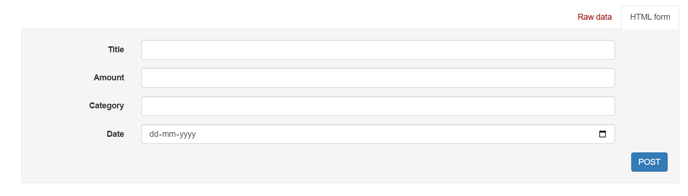
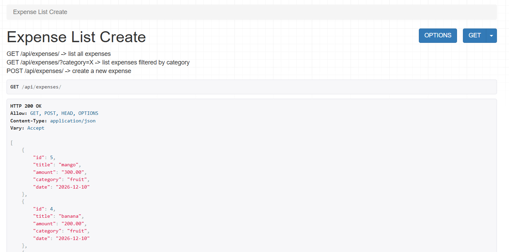
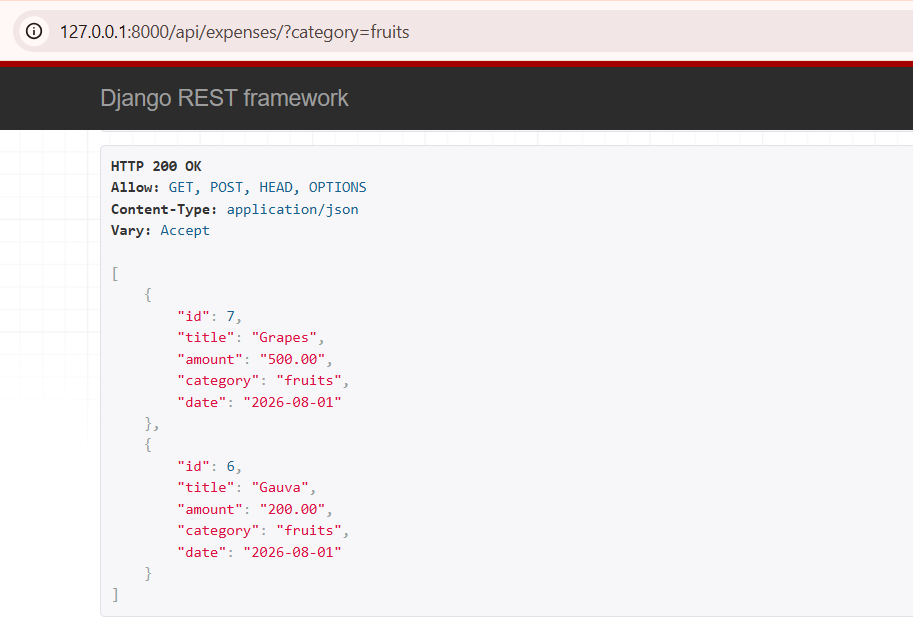
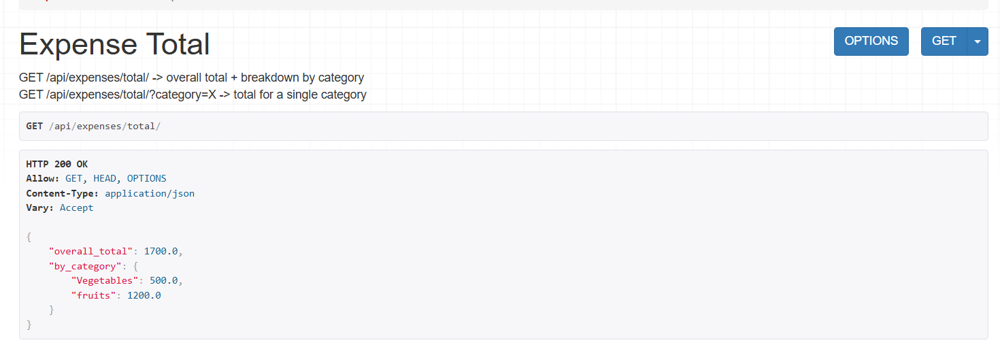
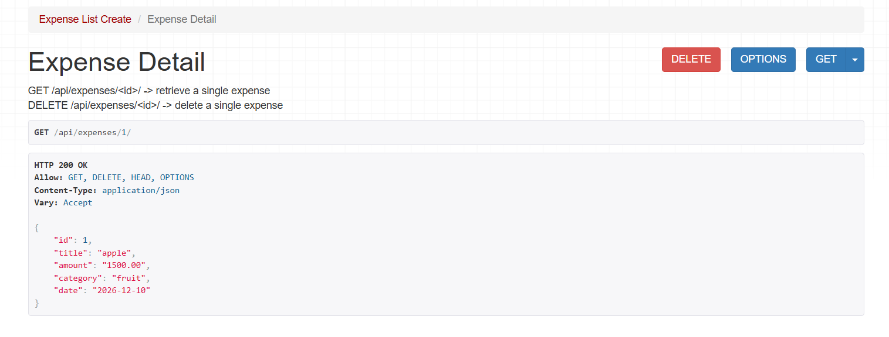
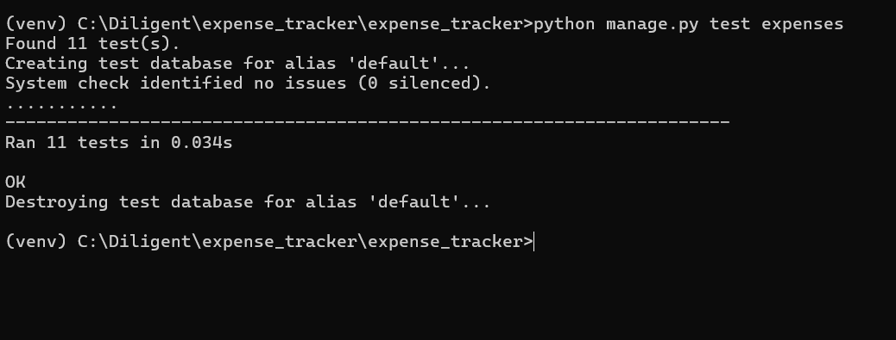

# 💰 Smart Expense Tracker API

A RESTful API for managing personal expenses, built with **Django** and **Django REST Framework**. This project was developed as part of the **Diligent Software Engineering Apprenticeship 2026** take-home assignment.

---

## ✨ Features

- ✅ Add a new expense
- ✅ View all expenses
- ✅ Retrieve a specific expense
- ✅ Filter expenses by category (case-insensitive)
- ✅ Calculate total expenses
  - Overall total
  - Category-wise totals
- ✅ Delete an expense
- ✅ Input validation
- ✅ Unit tests

---

## 🛠️ Tech Stack

| Technology | Version |
|------------|---------|
| Python | 3.x |
| Django | 6.0.7 |
| Django REST Framework | 3.17.1 |
| Database | SQLite |

---

## 📂 Project Structure

```text
diligent-expense-tracker-api/
├── config/
│   ├── __init__.py
│   ├── asgi.py
│   ├── settings.py
│   ├── urls.py
│   └── wsgi.py
│
├── expenses/
│   ├── migrations/
│   ├── __init__.py
│   ├── admin.py
│   ├── apps.py
│   ├── models.py
│   ├── serializers.py
│   ├── tests.py
│   ├── urls.py
│   └── views.py
│
├── screenshots/
│   ├── create_expense.png
│   ├── list_expenses.png
│   ├── retrieve_expense.png
│   ├── delete_expense.png
│   └── total_by_category.png
│
├── AI_NOTES.md
├── README.md
├── manage.py
└── requirements.txt
```
---

## 📂 Project Setup

Clone the repository:
```bash
git clone https://github.com/sangu0005/diligent-expense-tracker-api.git
cd diligent-expense-tracker-api
```

Create and activate a virtual environment.

### Windows

```bash
python -m venv venv
venv\Scripts\activate
```

### Linux / macOS

```bash
python3 -m venv venv
source venv/bin/activate
```

Install the dependencies:

```bash
pip install -r requirements.txt
```

Apply database migrations:

```bash
python manage.py migrate
```

---

## ▶️ Run the Development Server

```bash
python manage.py runserver
```

The API will be available at:

```
http://127.0.0.1:8000/api/
```

---

## 🧪 Running the Tests

```bash
python manage.py test expenses
```

**Test Coverage**

- Expense creation
- Field validation
- List expenses
- Category filtering
- Retrieve expense by ID
- Delete expense
- Expense total calculations

**Total Tests:** **11**

---

## 📝 Example Request

### Create an Expense

**POST** `/api/expenses/`

```json
{
    "title": "Groceries",
    "amount": "42.50",
    "category": "Food",
    "date": "2026-07-30"
}
```

---

# 📚 API Reference

| Method | Endpoint | Description |
|--------|----------|-------------|
| **POST** | `/api/expenses/` | Create a new expense |
| **GET** | `/api/expenses/` | Retrieve all expenses |
| **GET** | `/api/expenses/?category=Food` | Filter expenses by category (case-insensitive) |
| **GET** | `/api/expenses/<id>/` | Retrieve an expense by ID |
| **DELETE** | `/api/expenses/<id>/` | Delete an expense |
| **GET** | `/api/expenses/total/` | Retrieve overall and category-wise expense totals |

---

## 📌 Example Endpoints

| Endpoint | URL |
|----------|-----|
| List Expenses | `http://127.0.0.1:8000/api/expenses/` |
| Filter by Category | `http://127.0.0.1:8000/api/expenses/?category=Food` |
| Get Expense | `http://127.0.0.1:8000/api/expenses/2/` |
| Delete Expense | `http://127.0.0.1:8000/api/expenses/1/` |
| Get Totals | `http://127.0.0.1:8000/api/expenses/total/` |

---
## 📸 Screenshots

### Create Expense (POST)



---

### List Expenses (GET)



---

### Filter by Category



---

### Expense Totals



---

### Delete Expense



---

### Run Tests


